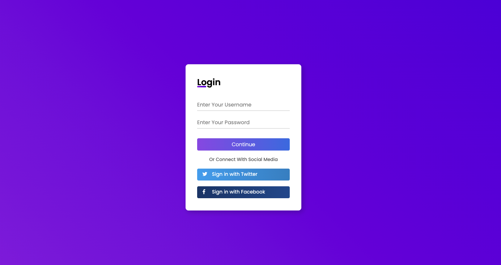

# Responsive Login Form

This is a simple and responsive login form made with HTML and CSS using transitions. 
This project was made with a youtube tutorial.  
**Youtube link: https://youtu.be/MkXuQ9CcHqU**

### Final Result

## 🚀 Starting

To start the project, just open the file `index.html` in your preferred browser.

---
##### Coded by Humberto Galdino
